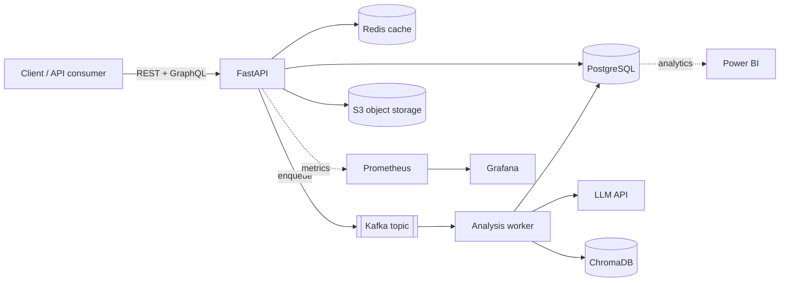

# HireSignal

**An AI-powered job-application tracker and resume analyzer — a secure, containerized, production-shaped backend.**


HireSignal turns *"does my resume fit this role?"* into a measurable, explainable signal.
It stores job postings, resumes, and applications behind a secure REST API, and is designed
to score resume↔job matches with a Retrieval-Augmented Generation (RAG) pipeline, surface
skill gaps, and track every application through its hiring stages.

> **Status:** actively developed. The core API, authentication, and data layer are complete;
> the AI analysis, asynchronous processing, and observability layers are on the roadmap below.

## Architecture



## Features

**Available now**
- 🔐 **JWT authentication** — bcrypt-hashed passwords, OAuth2 password flow, protected routes
- 📇 **Typed REST API** for jobs, resumes, and applications with full CRUD, validation, and correct HTTP semantics
- 🗃️ **PostgreSQL** with SQLAlchemy 2.0 models, deliberate indexing, and versioned **Alembic** migrations
- ⚡ **Redis cache-aside** on read endpoints for sub-millisecond hot reads
- 🐳 **One-command Docker stack** (API + PostgreSQL + Redis) with health checks and named volumes
- 📖 **Auto-generated OpenAPI docs** at `/docs`

**On the roadmap**
- 🤖 AI resume↔job match scoring & gap analysis (LangChain + RAG + ChromaDB + sentence-transformers)
- 🧵 Asynchronous analysis pipeline (Apache Kafka producer/consumer)
- ☁️ Object storage for uploads (AWS S3)
- 📊 Observability (Prometheus + Grafana) and BI analytics (Power BI)
- 🕸️ GraphQL API (Strawberry) alongside REST
- 🏗️ Infrastructure as Code (Terraform: S3, IAM, ECR)

## Tech stack

| Layer | Technology | Why |
|------|------------|-----|
| API | **FastAPI** | Async, type-safe, auto-generated OpenAPI docs |
| Database | **PostgreSQL 16** | Relational integrity + powerful analytical SQL |
| ORM / migrations | **SQLAlchemy 2.0 + Alembic** | Typed models + versioned, reversible schema changes |
| Cache | **Redis 7** | Sub-millisecond cache-aside for hot reads |
| Auth | **JWT + bcrypt** (python-jose, passlib) | Stateless, horizontally-scalable authentication |
| Packaging | **Docker + Compose** | Reproducible, one-command environment |
| AI *(roadmap)* | **LangChain · ChromaDB · sentence-transformers** | RAG-based match scoring |
| Async *(roadmap)* | **Apache Kafka** | Durable, scalable event pipeline |

## Getting started

**Prerequisite:** [Docker Desktop](https://www.docker.com/products/docker-desktop/).

```bash
git clone https://github.com/Mdasiftalukdar/HireSignal.git
cd HireSignal
cp .env.example .env        # review and adjust secrets
docker compose up --build
```

- API base: `http://localhost:8000`
- Interactive docs: `http://localhost:8000/docs`

Apply database migrations (first run):

```bash
docker compose exec api alembic upgrade head
```

## API overview

| Area | Endpoints |
|------|-----------|
| **Auth** | `POST /api/v1/auth/register` · `POST /api/v1/auth/login` · `GET /api/v1/auth/me` |
| **Jobs** | `POST/GET/PATCH/DELETE /api/v1/jobs` |
| **Resumes** | `POST/GET/PATCH/DELETE /api/v1/resumes` |
| **Applications** | `POST/GET/PATCH/DELETE /api/v1/applications` |

All resource endpoints require a `Bearer` token. Obtain one via `/auth/login`, then use the
**Authorize** button in `/docs` or send `Authorization: Bearer <token>`.

## Project structure

```
app/
├── api/routes/     # HTTP endpoints (auth, jobs, resumes, applications)
├── core/           # configuration and security (hashing, JWT)
├── db/             # async engine, session, declarative base
├── models/         # SQLAlchemy ORM models
└── schemas/        # Pydantic request/response models
alembic/            # database migrations
```
