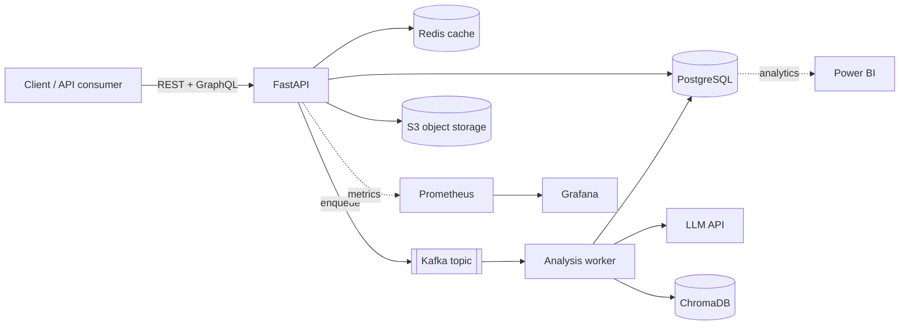

# 🚀 HireSignal

**AI-Powered Job Application Tracker & Resume Analyzer**

HireSignal ingests your resume and a target job posting, then uses a Retrieval-Augmented
Generation (RAG) pipeline to score the match, surface skill gaps, and draft tailored
application material — all behind a production-shaped, fully containerized backend.

> **Status:** 🏗️ Under active construction — built phase-by-phase (see roadmap below).

---

## Why this project exists

Job searching is noisy and repetitive. HireSignal turns *"does my resume fit this role?"*
into a measurable, explainable signal — while doubling as an end-to-end showcase of modern
backend, AI, data, and infrastructure engineering.

## Architecture (target)



## Tech stack & why

| Layer | Tech | Why it's here |
|------|------|---------------|
| API | **FastAPI** | Async, type-safe, auto-generated OpenAPI docs |
| Database | **PostgreSQL** | Relational integrity + powerful analytical SQL |
| Cache | **Redis** | Sub-millisecond cache-aside for hot reads & LLM reuse |
| ORM / migrations | **SQLAlchemy + Alembic** | Typed models + versioned schema changes |
| AI orchestration | **LangChain** | Composable chains over LLMs |
| Vector store | **ChromaDB** | Embedding storage + similarity search for RAG |
| Embeddings | **sentence-transformers** | Local, free, no per-call cost |
| Async pipeline | **Kafka** | Durable, scalable event queue for slow AI jobs |
| Second API | **GraphQL (Strawberry)** | Flexible nested fetching alongside REST |
| Object storage | **AWS S3** | Durable storage for resume files |
| Observability | **Prometheus + Grafana** | Metrics collection + live dashboards |
| Analytics | **Power BI + advanced SQL** | Business-facing reporting layer |
| Infra as code | **Terraform** | Declarative, reviewable infrastructure |
| Packaging | **Docker + Compose** | One-command reproducible stack |
| CI | **GitHub Actions** | Automated tests on every push |

## Build phases

- [x] **Phase 0 — Foundations** · repo, structure, config, git
- [x] **Phase 1 — Dockerized skeleton** · Compose: FastAPI + Postgres + Redis
- [ ] **Phase 2 — Data layer** · SQLAlchemy models, Alembic migrations, indexes
- [ ] **Phase 3 — Core API** · CRUD, JWT auth, Redis cache-aside
- [ ] **Phase 4 — AI job parser** · LangChain structured extraction
- [ ] **Phase 5 — RAG pipeline** · PDF → chunk → embed → Chroma → match report
- [ ] **Phase 6 — AI in the API** · /analyze, background jobs, S3 upload
- [ ] **Phase 7 — Observability** · Prometheus metrics + Grafana
- [ ] **Phase 8 — Analytics** · window functions, SQL views, Power BI
- [ ] **Phase 9 — Kafka** · async producer/consumer
- [ ] **Phase 10 — GraphQL** · Strawberry + DataLoader
- [ ] **Phase 11 — Terraform** · S3 / IAM / ECR as code
- [ ] **Phase 12 — Polish & deploy** · README, CI, diagram, demo, launch

## Quickstart

> Available from Phase 1 onward.

```bash
cp .env.example .env       # then fill in secrets
docker compose up --build
# API docs at http://localhost:8000/docs
```

## Learning notes

Concept explanations captured as we build live in
[`docs/learning-notes.md`](docs/learning-notes.md).
