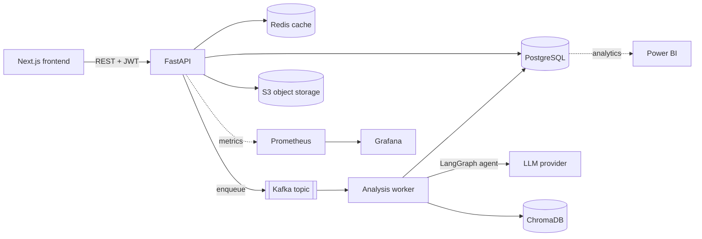
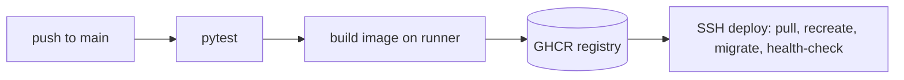

# HireSignal

**A full-stack, AI-powered resume analyzer and job-application tracker. Live in production, secure, and containerized end to end.**

**▶ Live demo:** [hire-signal-gilt.vercel.app](https://hire-signal-gilt.vercel.app) &nbsp;·&nbsp; **API health:** [hiresignal-asif.duckdns.org/health](https://hiresignal-asif.duckdns.org/health)

[](https://github.com/Mdasiftalukdar/HireSignal/actions/workflows/ci.yml)
[](https://github.com/Mdasiftalukdar/HireSignal/actions/workflows/deploy.yml)


HireSignal turns *"does my resume fit this role?"* into a measurable, explainable signal. You add a
resume and a job description; it scores the fit like a recruiter's ATS, shows the skills and keywords
you are missing, rewrites your bullet points, and lets you edit and export a polished resume. Every
check is saved so you can track each application through its stages.

The backend is a secure REST + GraphQL API with a Retrieval-Augmented Generation (RAG) pipeline; the
frontend is a Next.js app. The whole stack runs with one `docker compose up`.

## Architecture


```mermaid
flowchart LR
    UI[Next.js frontend] -->|REST + JWT| API[FastAPI]
    API --> PG[(PostgreSQL)]
    API --> REDIS[(Redis cache)]
    API -->|enqueue| KAFKA[[Kafka topic]]
    KAFKA --> WORKER[Analysis worker]
    WORKER -->|LangGraph agent| LLM[LLM provider]
    WORKER --> CHROMA[(ChromaDB)]
    WORKER --> PG
    API --> S3[(S3 object storage)]
    API -.metrics.-> PROM[Prometheus]
    PROM --> GRAF[Grafana]
    PG -.analytics.-> PBI[Power BI]
```

## Features

**Frontend (Next.js)**
- Marketing landing page, plus a full app behind authentication
- Sign in with Google or email and password, with an email one-time-code verification step and a
  forgot-password reset flow (emailed code, generic responses that avoid account enumeration)
- Dashboard with usage counters and quick actions
- Analyze flow: pick a saved resume, upload one, or paste text, add a job description, and watch the
  status stream in live (Server-Sent Events)
- Match report: fit score, matched and missing skills, keyword coverage, section fixes, weaknesses,
  and ready-to-paste bullet points
- Application tracker with inline editing of applied status and outcome
- Live A4 resume editor with a WYSIWYG preview, AI bullet suggestions, and export to real PDF and DOCX
- Settings: manage saved resumes and your own encrypted LLM key

**Backend (FastAPI)**
- JWT authentication (bcrypt-hashed passwords, OAuth2 password flow, protected routes)
- Typed REST API for jobs, resumes, and applications with full CRUD and correct HTTP semantics
- PostgreSQL with SQLAlchemy 2.0 models, deliberate indexing, and versioned Alembic migrations
- Redis cache-aside on read endpoints for fast hot reads
- AI job-description parser: LangChain structured extraction to typed JSON
- AI resume-to-job matching (RAG): fit score, skill gaps, keyword coverage, section fixes, and bullets
- Agentic analysis (LangGraph) layered on LangChain: retrieve, grade relevance, generate, self-critique,
  and finalize, with a policy that keeps the free tier on a single cheaper call
- Multi-provider LLM layer with automatic fallback (OpenRouter, then Gemini, then DeepSeek)
- Async analysis pipeline: the API accepts the job and returns immediately; a Kafka consumer does the work
- Object storage (S3 or MinIO) for saved resumes, using the same code that targets AWS S3
- Multi-format uploads: PDF, DOCX, and TXT, or pasted text
- Per-user accounts: up to 5 saved resumes, bring-your-own LLM key (encrypted) for unlimited use, or a
  daily free limit with usage counters
- Observability: Prometheus metrics and provisioned Grafana dashboards
- SQL analytics layer: reporting views and a window-function query library ([`analytics/`](analytics/))
- GraphQL API (Strawberry) alongside REST, with a DataLoader (N+1 solved) and a playground at `/graphql`
- Infrastructure as Code (Terraform): S3, least-privilege IAM, and ECR, validated and planned
  ([`infra/terraform/`](infra/terraform/))
- CI/CD (GitHub Actions): tests gate pull requests; a push to `main` builds an immutable image, pushes
  it to the GitHub Container Registry, and auto-deploys the backend to the server over SSH

**On the roadmap**
- Time-boxed AWS deployment (ECS/Fargate) on the existing Terraform infrastructure, as a portable-cloud demo
- Format-preserving resume import (preserve the original fonts and bold)
- Power BI dashboard on the analytics views

## Tech stack

| Layer | Technology |
|-------|------------|
| Frontend | Next.js 16, React 19, TypeScript, Tailwind CSS 4 |
| API | FastAPI (async), Pydantic |
| Database | PostgreSQL 16 |
| ORM / migrations | SQLAlchemy 2.0, Alembic |
| Cache | Redis 7 |
| Auth | JWT + bcrypt (python-jose, passlib), Google OAuth (Authlib), email OTP |
| AI | LangChain, LangGraph, ChromaDB, sentence-transformers |
| Messaging | Apache Kafka |
| Storage | AWS S3 (MinIO locally) |
| Observability | Prometheus, Grafana |
| Infra | Docker Compose, Terraform |
| Deployment | Vercel (frontend), Oracle Cloud Always Free ARM VM, Caddy (HTTPS / Let's Encrypt) |
| CI/CD | GitHub Actions, GitHub Container Registry (GHCR) |

## Deployment & CI/CD

HireSignal runs as a live, public product:

- **Frontend** on **Vercel**, auto-deploying on every push to `main`.
- **Backend** as the full Docker Compose stack on an **Oracle Cloud (aarch64) VM, previously it was on Hetzner (x86) VM**, with
  **Caddy** terminating HTTPS (automatic Let's Encrypt certificates) and reverse-proxying to the API.

Backend deploys are automated. A push to `main` that touches backend code runs a GitHub Actions pipeline
(the image is built on a native **arm64** runner to match the server):


```mermaid
flowchart LR
    PUSH[push to main] --> TEST[pytest]
    TEST --> BUILD[build image on runner]
    BUILD --> GHCR[(GHCR registry)]
    GHCR --> DEPLOY[SSH deploy: pull, recreate, migrate, health-check]
```

The image is built once on GitHub's runners and pushed to the GitHub Container Registry tagged by commit
SHA, so the server pulls a reproducible, immutable artifact instead of building on the box; the same image
runs the API and the Kafka worker. Locally, an auto-loaded `docker-compose.override.yml` restores
hot-reload and bind-mounted source, while the server runs the base file plus a production overlay, so it
always runs the built image.

## Getting started

**Prerequisite:** [Docker Desktop](https://www.docker.com/products/docker-desktop/).

```bash
git clone https://github.com/Mdasiftalukdar/HireSignal.git
cd HireSignal
cp .env.example .env        # review and set your values
docker compose up --build
```

Then apply the database migrations (first run):

```bash
docker compose exec api alembic upgrade head
```

Services:

| Service | URL |
|---------|-----|
| Frontend | http://localhost:3001 |
| API + Swagger docs | http://localhost:8000/docs |
| GraphQL playground | http://localhost:8000/graphql |
| Grafana | http://localhost:3000 |
| MinIO console | http://localhost:9001 |
| MailPit (dev inbox) | http://localhost:8025 |

### Frontend development

The compose `frontend` service runs the Next.js dev server with the source bind-mounted, so your
edits hot-reload in the browser with no rebuild. It starts with the default `docker compose up`.

To run the frozen production build instead (served on port 3002):

```bash
docker compose --profile prod up -d --build frontend-prod   # http://localhost:3002
```

You can also run the dev server directly on the host if you prefer: `npm --prefix frontend run dev`.

## How the AI analysis works

1. The resume text is chunked and embedded locally (sentence-transformers) into ChromaDB.
2. For a given job description, the most relevant resume chunks are retrieved.
3. A LangGraph agent grades whether the context is sufficient (and re-retrieves if not), generates a
   structured match report, then critiques its own draft and regenerates once if needed.
4. The simple synchronous endpoints (`/ai/match`, `/ai/parse-job`) use plain LangChain chains, so both
   LangChain and LangGraph are used where each fits best.

## Tests

```bash
pip install -r requirements-dev.txt
pytest
```

The same fast unit tests (chunking, auth, text extraction) run in CI on pull requests, and again as the
first gate of the deploy pipeline on every push to `main`.

## Project structure

```
app/
  api/routes/     HTTP endpoints (auth, jobs, resumes, applications, ai, me)
  core/           configuration, security, crypto, cache, metrics, oauth
  db/             async engine, session, declarative base
  models/         SQLAlchemy ORM models
  schemas/        Pydantic request/response models
  services/       RAG, embeddings, LLM factory, LangGraph agent, storage, email, OTP
  workers/        Kafka consumer
frontend/
  src/app/        Next.js routes (landing, auth, dashboard, analyze, tracker, editor, settings)
  src/components/ shared UI
  src/lib/        API client, auth context, resume model and export
alembic/          database migrations
analytics/        SQL views, functions, and query library
infra/            Prometheus, Grafana, Terraform
```
